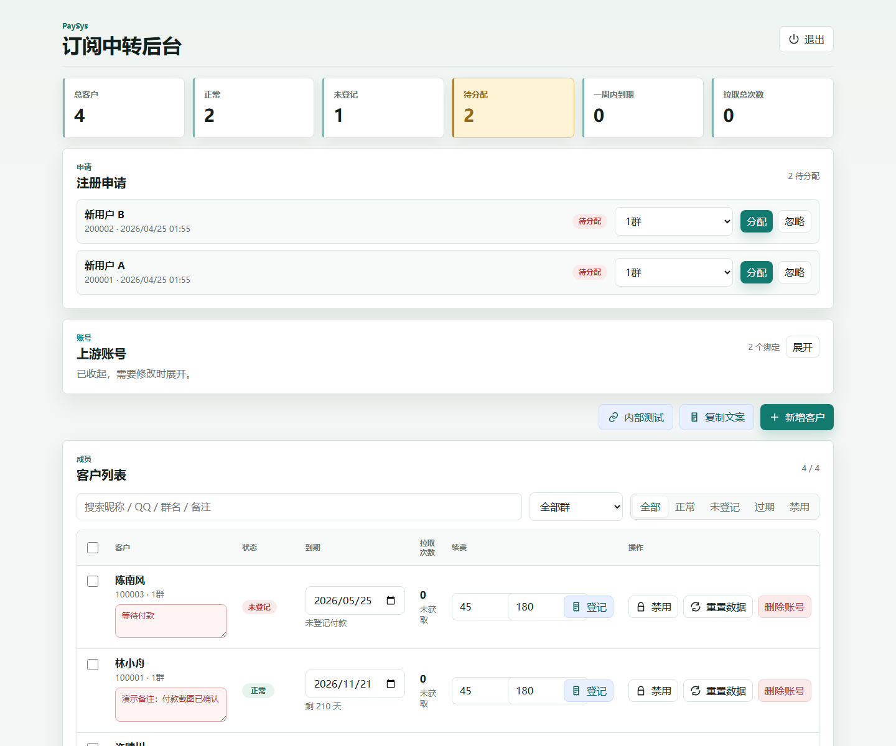
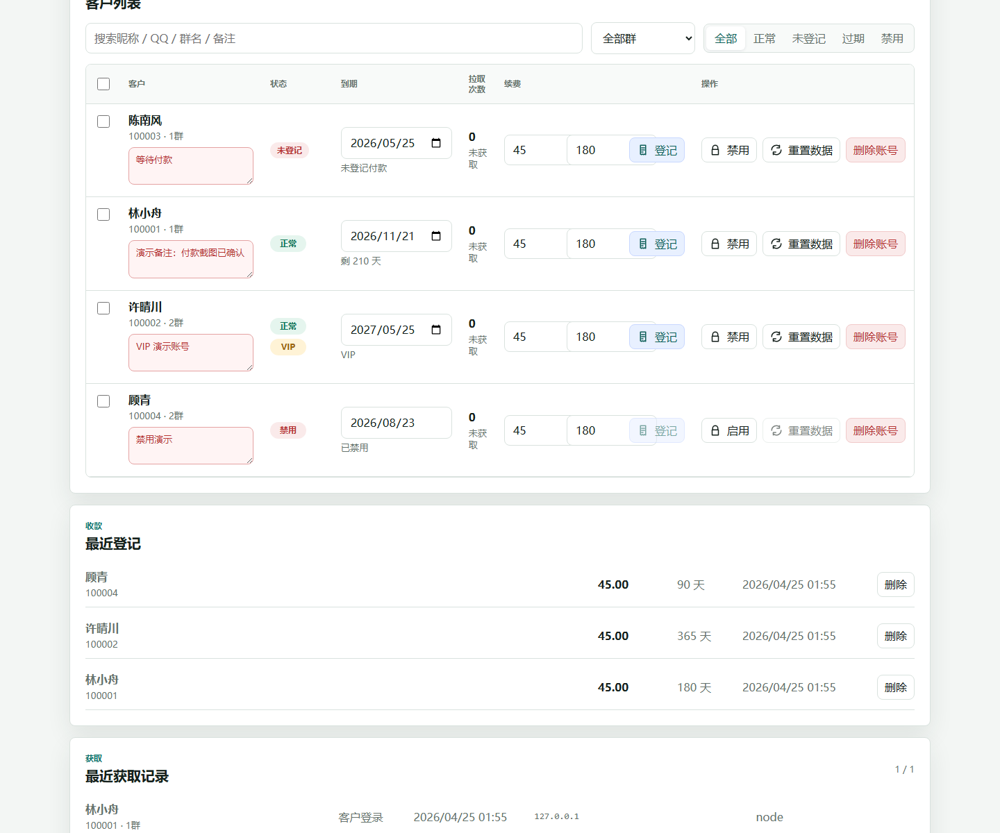
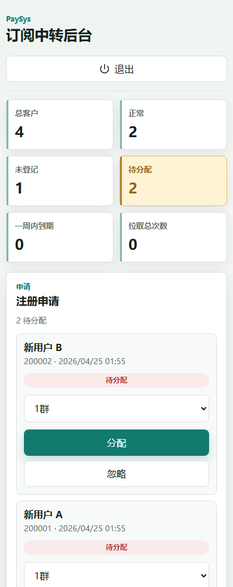
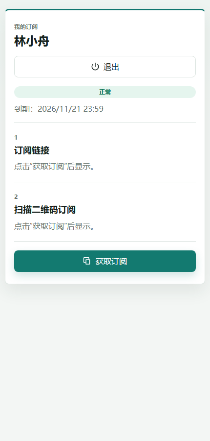
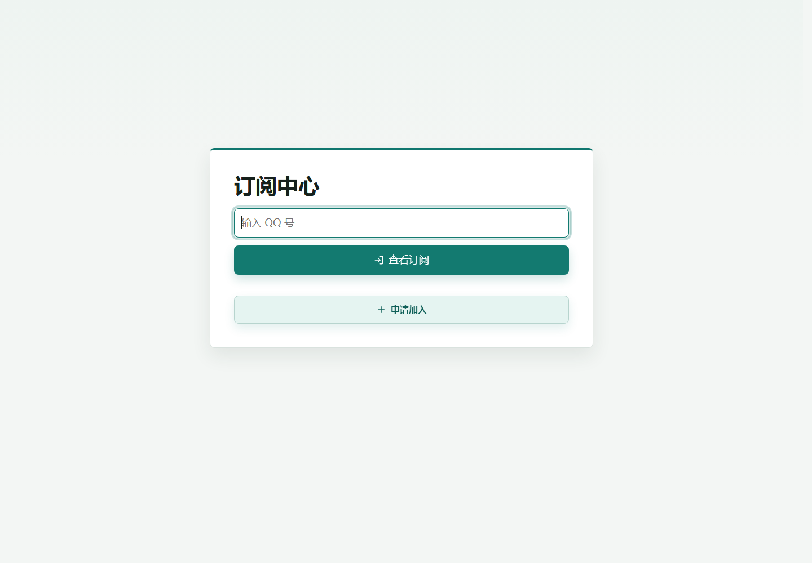
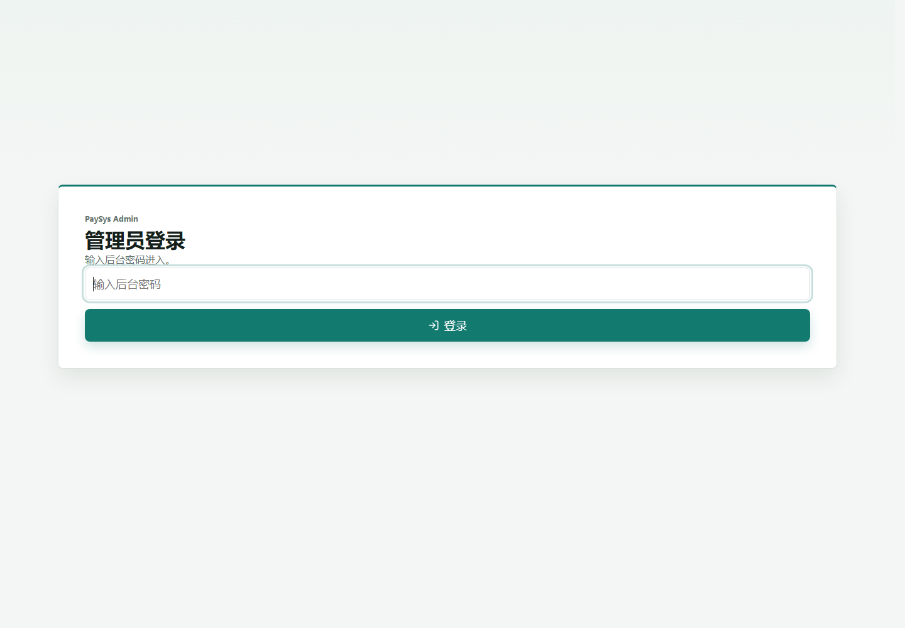

# PaySys

[English](README.md) | [Simplified Chinese](README.zh-CN.md)


PaySys is a self-hosted subscription relay and customer-access management dashboard built with Next.js, TypeScript, and SQLite.

It gives an operator a clean admin console for managing customers, groups, renewals, notes, VIP status, disabled accounts, access logs, upstream accounts, and encrypted database backups. Customers use a separate `/portal` flow to sign in with their registered QQ number and retrieve their own stable `/sub/[token]` subscription endpoint.

The project is intentionally small enough to run on a single cloud machine, but it still demonstrates production-minded full-stack work: authentication boundaries, relational persistence, token-based access control, audit logging, environment-based secrets, deployment scripts, backup and restore tooling, tests, and release-ready documentation.

## Preview

The main screens cover the admin workflow, mobile approval flow, customer portal, and login surfaces.

| Admin overview | Customer management |
|---|---|
|  |  |

| Mobile approval flow | Customer subscription center |
|---|---|
|  |  |

| Customer entry | Admin login |
|---|---|
|  |  |

## Why This Project Is Useful

PaySys is useful when a small team needs to operate a customer-facing subscription access workflow without exposing upstream provider links or manually editing spreadsheets.

It turns a fragile manual process into a managed product surface:

- Customers get a stable portal and tokenized subscription URL.
- Operators get searchable customer records, renewal history, notes, group routing, and status controls.
- Disabled or expired accounts stop receiving subscription content through the relay.
- Upstream subscription content is cached and served through controlled endpoints.
- Database backups can be encrypted and pushed to a separate private backup repository.
- The app can be deployed and monitored with repeatable PowerShell scripts on a Windows cloud machine.

The value is in the full operational loop: a real admin workflow connected to persistence, access control, operational scripts, tests, and deployment documentation.

## Engineering Highlights

- Full-stack Next.js App Router application with server-rendered pages and API routes.
- TypeScript data contracts around customer, payment, registration, upstream, and access-log flows.
- SQLite persistence through `better-sqlite3`, including schema migration and focused DB tests.
- Separate admin and customer authentication layers using HTTP-only cookies.
- Token-based subscription access through `/sub/[token]`.
- Group-aware upstream account routing, allowing different customer groups to use different upstream credentials.
- Customer-facing portal with QQ login, self-service registration, subscription link display, and QR code generation.
- Admin dashboard with registration approval, renewal tracking, inline notes, filtering, bulk VIP updates, and access logs.
- Encrypted SQLite backup and restore workflow with AES-256-GCM.
- Windows-friendly deployment and monitoring scripts for a small cloud-machine setup.
- Vitest, ESLint, production build checks, and `npm audit` workflow documented for maintenance.

## Architecture

| Layer | Responsibility |
|---|---|
| `src/app` | Next.js App Router pages and API routes |
| `src/components` | Admin and customer-facing React interfaces |
| `src/lib/db.ts` | SQLite schema, migrations, customer, payment, cache, registration, and log operations |
| `src/lib/auth.ts` | Admin session cookies |
| `src/lib/user-auth.ts` | Customer portal session cookies |
| `src/lib/upstream.ts` | Upstream account login, subscription refresh, and cache retrieval |
| `scripts/` | Backup, restore, monitoring, and operational helpers |
| `docs/screenshots/` | Public README screenshots |

Main request flow:

1. A customer opens `/portal` and signs in with a registered QQ number.
2. The portal issues an HTTP-only customer session cookie.
3. The customer requests their subscription endpoint.
4. PaySys validates account status, expiry, disabled state, and token ownership.
5. The relay returns cached upstream subscription content through `/sub/[token]`.
6. Admin pages show customer state, renewal records, and access logs.

## Security Model

- Runtime secrets are configured through `.env` and are not committed.
- Admin access uses a separate password-protected session.
- Customer access uses a separate QQ-based portal session.
- The upstream dashboard URL and temporary upstream subscription URL are not exposed to customers.
- Expired, disabled, or invalid-token customers cannot retrieve subscription content.
- Real SQLite data, encrypted backups, recovery keys, and local environment files are ignored by Git.
- Production deployments should use HTTPS when exposed outside the local machine.

This is a lightweight access-control layer for a trusted small-team environment. QQ-only customer login is intentionally simple; larger deployments should add stronger verification such as one-time codes or CAPTCHA.

## Getting Started

Recommended runtime:

- Node.js `20.19+` or Node.js `22 LTS`
- npm
- Windows PowerShell for the included operational scripts

Install and run locally:

```powershell
npm install
Copy-Item .env.example .env
npm run dev
```

Open:

- Admin dashboard: [http://localhost:3000/admin](http://localhost:3000/admin)
- Customer portal: [http://localhost:3000/portal](http://localhost:3000/portal)

If `ADMIN_PASSWORD` is not set, local development falls back to `admin123`. Change it before any real deployment.

## Environment Variables

Copy `.env.example` to `.env` and configure:

```env
ADMIN_PASSWORD=change-me
ADMIN_SESSION_SECRET=replace-with-a-long-random-secret
LILISI_EMAIL=your-upstream-account@example.com
LILISI_PASSWORD=your-upstream-password
PAYSYS_DB_PATH=./data/paysys.sqlite
```

Notes:

- Keep `.env` private.
- Keep `ADMIN_SESSION_SECRET` stable after deployment, or existing sessions will be invalidated.
- Treat `data/` as sensitive because it stores customer records and upstream account configuration.

## Core Features

- Admin login and session management.
- Customer portal login by registered QQ number.
- Customer self-registration requests.
- Registration approval with group assignment.
- Customer CRUD with QQ, group, notes, expiry, disabled state, and VIP flag.
- Inline note editing from the admin customer table.
- Renewal registration with default amount and duration.
- Payment history and deletion.
- Customer access logs for portal login, subscription retrieval, and client fetches.
- Token reset and customer data reset.
- Group-specific upstream account binding.
- Cached upstream subscription content.
- Customer subscription link and QR code display.
- Subscription output cleanup for upstream promotional or official-link nodes.
- Internal admin-only testing endpoint for group-level subscription validation.
- Encrypted SQLite backup and restore scripts.

## Common Commands

```powershell
npm run dev
npm run lint
npm test
npm run build
npm run start -- -p 3000
```

Dependency security check:

```powershell
npm audit --registry=https://registry.npmjs.org --audit-level=high
```

Some npm mirrors do not implement `audit`, so the official registry is used for the security check.

## Deployment

Production build:

```powershell
npm install
Copy-Item .env.example .env
notepad .env
npm run build
npm run start -- -p 3000
```

For external phone or customer access, use one of:

- A public server IP with the required firewall rules.
- A reverse proxy with HTTPS.
- A tunnel service such as Cloudflare Tunnel.

For Windows cloud-machine deployments, the repository includes a monitoring script:

```powershell
powershell.exe -NoProfile -ExecutionPolicy Bypass -File .\scripts\paysys-monitor.ps1 -ForceNotify
```

To start or recover PaySys automatically after the Windows user logs in, register a Scheduled Task:

```powershell
powershell.exe -NoProfile -ExecutionPolicy Bypass -File .\scripts\register-paysys-autostart.ps1
```

The task runs `scripts/paysys-monitor.ps1 -NoNotify` after login, so it can recover both the local PaySys process and the configured Cloudflare Tunnel service without sending a startup notification.

Optional `.monitor.env` settings:

```env
PUBLIC_BASE_URL=https://your-domain.example
CLOUDFLARED_SERVICE_NAME=Cloudflared
CLOUDFLARED_TUNNEL_NAME=paysys
BARK_BASE_URL=https://api.day.app/your-bark-key
```

Do not commit `.monitor.env`.

## Backup And Restore

PaySys stores customer, payment, access-log, VIP, upstream-account, and cache data in SQLite.

Important files:

```text
data/paysys.sqlite
data/paysys.sqlite-wal
data/paysys.sqlite-shm
```

Encrypted backup tooling:

- `scripts/backup-paysys.ps1`
- `scripts/backup-paysys.js`
- `scripts/restore-paysys-backup.js`

Manual backup:

```powershell
powershell.exe -NoProfile -ExecutionPolicy Bypass -File .\scripts\backup-paysys.ps1
```

Restore to a temporary database file:

```powershell
node .\scripts\restore-paysys-backup.js <PaySysBackups path>\backups\YYYY-MM\backup.sqlite.gz.enc .\data\restored-paysys.sqlite
```

Backup files are AES-256-GCM encrypted. Do not commit recovery keys, plaintext SQLite databases, encrypted backup archives, or temporary restored databases.

## Repository Layout

```text
src/app/                    Next.js pages and API routes
src/components/             React UI components
src/lib/db.ts               SQLite schema and data operations
src/lib/upstream.ts         Upstream refresh and subscription cache logic
src/lib/auth.ts             Admin session helpers
src/lib/user-auth.ts        Customer session helpers
scripts/                    Backup, restore, and monitoring scripts
docs/screenshots/           README screenshots
.env.example                Environment template
.monitor.env.example        Monitor script template
.backup.env.example         Backup script template
AGENTS.md                   Maintenance notes for future agent runs
```

## Known Limits

- All customer authentication currently relies on QQ number ownership in a small trusted environment.
- The app controls future `/sub/[token]` access, but it cannot revoke node configurations already imported into a client.
- Upstream refresh depends on the upstream provider API and can fail if credentials, API behavior, or risk-control rules change.
- SQLite is a strong fit for a small deployment, but larger multi-operator setups would likely need a managed database and stronger audit controls.

## License

MIT
